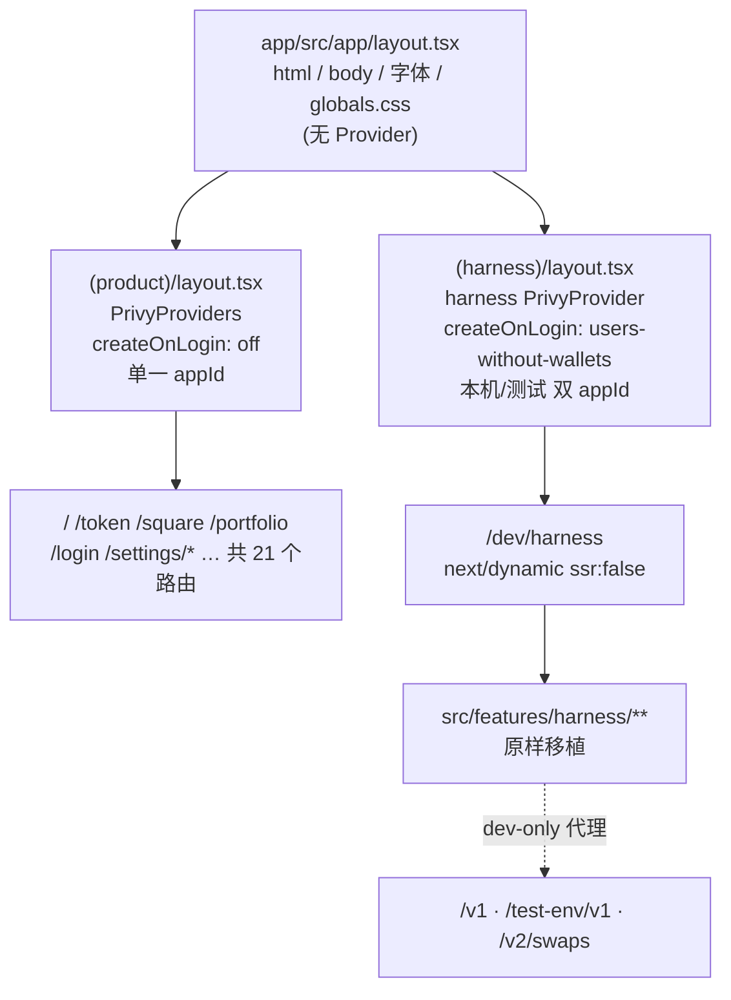

# web-embedded-harness → fomo-research-fe 迁移技术方案

| 项 | 值 |
|---|---|
| 文档类型 | **Design Doc**（已确定要做，细到可直接开编码） |
| 作者 | Claude Opus 5（需求澄清会话产出） |
| 评审人 | 待定 |
| 状态 | **草稿 — 待评审** |
| 版本 | v1.0 |
| 日期 | 2026-09-18 |
| 决策来源 | 2026-09-18 grilling 会话，26 条决策全部由用户确认 |

---

## Executive Summary

把 `web-embedded-harness`（Vite SPA，Privy 嵌入式钱包 + Solana 签名实跑台）整体迁入 `fomo-research-fe/app`（Next.js 16 App Router），落为内部调试页面 `/dev/harness`。

四条定性结论：**(1)** 它是内部调试工具，不进产品导航；**(2)** 受静态导出限制，迁移后**只在 `next dev` 下可用**，线上打不开；**(3)** 它继续连**主网、花真钱**，不切 devnet；**(4)** 采用**原样移植**而非重构，以保住「能与归档仓库逐文件对照」这一性质。

最大的技术障碍不是代码，是网络：`sx_fastswap` 对任何携带 `Origin` 的请求返回裸 `403`，而宿主是 `output: "export"` 的纯静态站点，线上没有服务端能剥离该请求头。

预估工作量 **~13.5 人天**，分 spike + 3 期。

---

## 1. 背景

### 1.1 现有系统

`web-embedded-harness`（`meme-embedded-harness`，分支 `feat/fastswap-v2`）是一个 Vite 7 + React 19 的单页应用，定位为「实跑台」：用真实浏览器、真实 Privy SDK、真实主网资金，验证 SmartX `business` API 与 Fast Swap v2 服务的端到端签名链路。它同时是原生客户端（App/Expo）的**参考实现**。

规模：

| 项 | 规模 |
|---|---|
| `App.tsx` | 2186 行（单文件，全部状态 `useState` 平铺，无 store） |
| `ui.tsx` | 999 行（手写组件库 + 整套 CSS 字符串，仓库内**零 CSS 文件**） |
| `SwapPanel.tsx` / `XBindPage.tsx` / `flow.ts` / `transfer.ts` | 736 / 716 / 679 / 390 行 |
| 其余 `src/*.ts` | ~20 个模块 |
| 测试 | 18 文件 / ~245 用例（node 环境，无 jsdom） |
| Node 脚本 | 3 个（`vite-node`） |
| 文档 | README 48KB + CONTEXT.md + 1 个 ADR + 27KB 调研 |

### 1.2 痛点 / 驱动因素

1. **仓库分散**：harness 与产品前端 `fomo-research-fe` 是两个独立仓库，同一套 Privy + Solana 链路维护在两处。
2. **能力重叠**：`fomo-research-fe` 已有一套 Privy 验证台（`/login` → `LoginBench.tsx`，含 `SelfCheckCard`/`PrivyStatusCard`/`WalletProvisionCard`/`EventLog`），与 harness 主题重合但覆盖面更窄。
3. **归档需求**：harness 需要转入只读归档状态，代码需要一个长期的去处。

### 1.3 为什么值得做

harness 是目前**唯一**同时覆盖「真实 Privy + 真实浏览器 + `resolveWallets` + 信封/6 位错误码/Bearer 中间件链」的东西。让它继续以孤立仓库存在，等于让最关键的验证能力脱离主代码库演进。

---

## 2. 目标与非目标

### 2.1 目标

| # | 目标 | 衡量方式 |
|---|---|---|
| G1 | harness 的 UI、逻辑、测试、CLI 脚本、文档迁入 `fomo-research-fe/app` | 见 §8 验收清单 |
| G2 | 迁移后行为与迁移前**一致** | 17 个测试文件 / ~235 用例全绿；登录链路人工验证通过 |
| G3 | 页面落为 `/dev/harness`，不进产品导航 | `layout.tsx` 的 `<nav>` 不含该路由 |
| G4 | 不破坏任何现有产品路由 | 21 个既有路由 URL 全部不变 |
| G5 | 源仓库转入归档只读状态 | README 顶部有 ARCHIVED 声明并已提交 |

### 2.2 非目标（**重要**）

| # | 非目标 | 理由 |
|---|---|---|
| N1 | **不重构 harness 代码** | 重构与迁移混进同一个 diff 是此类任务的标准翻车姿势。重构留到三期完成、测试全绿后作为独立任务 |
| N2 | **不让 harness 在线上可用** | 受 `output: "export"` 与 fastswap Origin 策略双重限制，见 §5.4 |
| N3 | **不完成「真链验收三笔」** | 该目标在源仓库中**从未达成**（`PROGRESS.md` step 7 未勾选）。把迁移前就欠的账挂到迁移验收上，是让迁移背不属于它的锅，且要花真钱 |
| N4 | **不迁移 X 绑定台** | 宿主已有等价实现，见 §5.7 |
| N5 | **不产品化 harness 的任何能力** | 它是调试工具，不是产品功能的孵化区 |
| N6 | **不抽取共享包** | 源仓库归档只读，双份维护的前提不成立 |
| N7 | **不改动 fastswap / business 后端** | 不申请 CORS 白名单，不扩大攻击面 |
| N8 | **不删除仓库中任何锁文件** | 影响全团队的仓库状态变更，超出本任务范围 |

---

## 3. 需求分析

### 3.1 功能性需求

迁移后 `/dev/harness` 须支持：

1. Privy 邮箱 OTP 无头登录 + OAuth（Google/Apple，受双重开关控制）
2. identity token → 站点 JWT 交换（`POST /v1/auth/login`）
3. 身份展示：identifier / Privy DID / 邮箱 / linked login types / JWT 剩余时间（仅本地解码，未验签）
4. 嵌入式钱包创建（**显式按钮，永不自动**）与地址展示（SVM + EVM）
5. 服务端联签授权 / 撤销（Privy signers，需 TEE 模式 + key quorum id）
6. 后端自检双探针（两个探针**都期望失败**才算通过）
7. Fast Swap v2 全流程：create → prepare → 预签检查 → 签名 → 后签检查 → 持久化 → 上报 → 轮询至终态，含 5 个故障注入开关
8. SPL 代币转出（绕过 business，直连 Solana RPC）
9. 持仓拉取与「填充卖出数据」
10. `本机` / `测试环境` 双环境切换
11. 过程日志、错误面板、6 位错误码解释

### 3.2 非功能性需求

| 维度 | 要求 |
|---|---|
| 运行环境 | **仅 `next dev`**，仅 `localhost`（非 IP —— Privy 强制 HTTPS，`http://<IP>` 会在渲染期抛错白屏） |
| 数据规模 | 单用户调试工具，无并发/吞吐要求 |
| 安全 | app secret 与 P-256 联签私钥**绝不可进入任何前端 bundle** |
| 资金 | 连主网、花真钱。防线 = 不可折叠警告横幅 + 不进导航 + 仅 dev 可用 |
| 可对照性 | 迁移后文件须能与归档仓库逐文件 diff |

---

## 4. 关键事实（实测，2026-09-18）

以下为本方案的事实基础，均由本会话实测或读取源码得出，**与两个仓库的文档均存在出入**，以此处为准。

### 4.1 后端 CORS 实测

```
GET  https://sm-test-api.smartx.io/v1/user/info          + Origin
  → 200, access-control-allow-origin: *                  可浏览器直连
  （harness README「business 不发 CORS 头」对测试环境已过时）

GET  https://sm-test-api.smartx.io/v2/swaps/capabilities  无 Origin
  → 200                                                   路由存在
  （PROGRESS.md「test-env v2 未接通」已过时）

GET  https://sm-test-api.smartx.io/v2/swaps/capabilities  + Origin
  → 403  "origin not allowed"                             致命
OPTIONS /v2/swaps                                          + Origin
  → 403
```

**结论**：任何网页都无法直连 fastswap，因为浏览器一定发送 `Origin`。harness 现在能跑，唯一原因是 `vite.config.ts:96-150` 的 proxy 在 `configure` 钩子里删掉了该请求头。

### 4.2 宿主约束

- `app/next.config.ts:14` = `output: "export"` —— 纯静态导出，Cloudflare Pages 托管，**线上无服务端运行时**
- `app/next.config.ts:4-6` = `reactStrictMode: false` —— 与 harness 要求一致（StrictMode 双跑 `createOnLogin` 曾于 2026-08-28 创建两个不可删除的真实钱包）
- `app/next.config.ts:22-31` `rewrites()` 已是 dev-only 模式，可复用该模式
- `app/node_modules` **不存在**，依赖未安装；`package-lock.json` 与 `pnpm-lock.yaml` 双锁并存，无 `packageManager` 字段

### 4.3 `@solana/kit` 3.0.3 → 8.2.0：零源码改动

harness 仅 2 个文件引用 kit，共 14 个导入符号：

| 结论 | 数量 |
|---|---|
| 在 v8 中存活 | **14 / 14** |
| 签名逐字节相同 | 13 |
| 仅类型约束改名（`BaseTransactionMessage` → `TransactionMessage`，harness 从不指名这些类型） | 1 |
| harness 用到 kit 8.0.0 删除的 API | **0** |

`@solana-program/token` 0.6.0 → 0.16.1 的三个入参对象（`AssociatedTokenSeeds` / `CreateAssociatedTokenIdempotentInput` / `TransferCheckedInput`）逐字节相同。`main.tsx:179-193` 的 Privy `solana.rpcs` 配置与宿主 `PrivyProviders.tsx:64-74` **是同一段代码**，宿主已在 v8 上运行。

**处置**：改三个版本号，源码不动。**不改写为 `@solana/web3.js` 1.98** —— 那会把零 diff 升级换成对 `transfer.ts:305-330`（幂等 ATA 竞态 + `transferChecked` 小数位）的手工重写，而这两处写错的失败模式是「跑通了但转错金额」。

### 4.4 运行时能力

```
node v26.7.0 · pnpm 8.15.4 · npm 11.19.0
webcrypto.subtle Ed25519: 可用
```

`fastswap/verify.ts:178-184` 依赖 `crypto.subtle` 的 Ed25519，该能力在本机可用，`verify.test.ts` 的 28 个用例不会因运行时缺能力失败。

⚠ **pnpm 版本风险**：`app/pnpm-workspace.yaml` 的 `allowBuilds` 键属 pnpm 10 系列，本机为 8.15.4。若 pnpm 8 不识别该键，`keccak` / `bigint-buffer` / `esbuild` / `sharp` 的原生构建脚本会被**静默跳过**，症状是安装期无报错、运行期才炸。安装前须先验证。

### 4.5 文档与代码的冲突（按「代码 > 测试 > 文档」裁决）

| 冲突 | 文档说法 | 代码事实 | 裁决 |
|---|---|---|---|
| `@solana-program/{memo,system}` | harness README：「别删」（称为 Privy 可选 peer） | `src/`/`scripts/` **无任何导入**，是死的直接依赖 | 删除直接声明。二者在宿主锁文件中已作为 `@solana-program/token` 的传递依赖存在，运行时不会断 |
| business CORS | harness README：不发 CORS 头 | 实测返回 `*` | 以实测为准 |
| test-env v2 | `PROGRESS.md`：未接通 | `/v2/swaps/capabilities` 返回 200 | 以实测为准 |
| `viem` | 未在 `package.json` 声明 | `src/adr0017.ts:18-19` 导入，靠 Privy 提升 | 迁入后由宿主已声明的 `viem ^2.56.0` 正式提供 |

---

## 5. 方案设计

### 5.1 整体架构



**核心设计点：provider 边界是静态的、结构性的。** 根 layout 不再持有任何 Provider；两个 route group 各自持有一套。这彻底消除嵌套 `PrivyProvider`（同一 appId 两个实例争抢同一批 `privy:` localStorage key，SDK 行为未定义）的可能。

**被否决的替代方案**：用 `usePathname()` 做条件包装，零目录移动、diff 更小。否决理由——它把一个**结构问题**（谁在 Provider 里）降级为**运行时条件**，将来任何人新增 `/dev/xxx` 路由都可能踩空；且依赖 `usePathname` 在静态导出预渲染期的行为，多一个未验证假设。

### 5.2 目录结构

```
app/
  src/app/
    layout.tsx                            改：Provider 下移，仅留 html/body/字体/globals
    (product)/layout.tsx                  新：PrivyProviders + FavoritesProvider + InviteGateListener
    (product)/page.tsx                    移：21 个既有路由目录 git mv 进入（route group 不影响 URL）
    (product)/token/ … (product)/settings/*/
    (harness)/layout.tsx                  新：harness 自己的 PrivyProvider
    (harness)/dev/harness/page.tsx        新：'use client' + next/dynamic({ssr:false})
    api/harness/[...path]/route.ts        新：dev-only 代理（构建期排除，见 §5.4）

  src/features/harness/                   新：harness 源码，原样
    buffer-shim.ts  config.ts  transport.ts  api.ts  codes.ts  errors.tsx
    trace.ts  jwt.ts  tokencache.ts  identity.ts  oauth.ts  signers.ts
    selfcheck.ts  balance.ts  transfer.ts  chains.ts  universe.ts
    adr0017.ts  signature.ts  ui.tsx  App.tsx
    envs.ts                               拆：纯配置
    envs.browser.ts                       拆：localStorage 态
    fastswap/  wire.ts client.ts store.ts flow.ts verify.ts SwapPanel.tsx
    fastswap/testdata/evm-calibur-typeddata.json
    *.test.ts(x)                          17 个测试文件，与源码同置

  scripts/harness/                        新：物理隔离于 src/
    probe.ts  universe.ts  privy-sign.ts  privySign.ts  privySign.test.ts

  docs/harness/                           新
    README.md  CONTEXT.md  adr/0001-harness-v2-only-reference-impl.md
    privy-examples-survey.md  migration-spec.md（本文档）  migration-notes.md
```

**不迁移**：`XBindPage.tsx`、`useXBind.ts`、`xcallback.ts`、`xpending.ts`、`ximport.ts`、`xcallback.test.ts`

**溶解**：`main.tsx` 不单独存在，其 Provider 配置进 `(harness)/layout.tsx`，其 fail-loud 配置检查与 `Boundary` 错误边界进 `page.tsx`。

### 5.3 环境变量映射

harness 的 17 处 `import.meta.env` 全部改为 `process.env.NEXT_PUBLIC_*`。**新增 env 读取统一收敛到宿主 `src/config.ts`**（宿主既有约定：集中一处，缺失时一处喊出来）。

| harness (Vite) | fomo (Next) | 用途 | 必需 |
|---|---|---|---|
| `VITE_PRIVY_APP_ID` | `NEXT_PUBLIC_HARNESS_PRIVY_APP_ID` | `本机` 环境的 Privy appId | 是 |
| `VITE_TEST_PRIVY_APP_ID` | `NEXT_PUBLIC_HARNESS_TEST_PRIVY_APP_ID` | **`测试环境` 标签页的总开关**，缺失则该档禁用 | 是 |
| `VITE_PRIVY_CLIENT_ID` | `NEXT_PUBLIC_HARNESS_PRIVY_CLIENT_ID` | 可选 client id（空串须转 `undefined`） | 否 |
| `VITE_SOLANA_RPC_URL` | 复用宿主 `NEXT_PUBLIC_SOLANA_RPC_URL` | Solana 主网 RPC，wss 由 `replace(/^http/,'ws')` 派生 | 是 |
| `VITE_ENABLE_GOOGLE` / `_APPLE` | 复用宿主 `NEXT_PUBLIC_ENABLE_GOOGLE` / `_APPLE` | OAuth 硬开关 | 否 |
| `VITE_PRIVY_KEY_QUORUM_ID` | `NEXT_PUBLIC_HARNESS_KEY_QUORUM_ID` | 联签 key quorum，缺失则授权按钮禁用 | 否 |
| `VITE_ENV_LABEL` / `VITE_TEST_ENV_LABEL` | `NEXT_PUBLIC_HARNESS_ENV_LABEL` / `_TEST_ENV_LABEL` | 标签页显示名 | 否 |
| `VITE_BUSINESS_ORIGIN_LABEL` / `VITE_TEST_BUSINESS_ORIGIN_LABEL` | `NEXT_PUBLIC_HARNESS_BUSINESS_LABEL` / `_TEST_BUSINESS_LABEL` | **仅显示**，从不参与发请求 | 否 |
| — | `NEXT_PUBLIC_ENABLE_HARNESS` | **页面总开关**，非 `'true'` 时渲染 not-found | 是 |
| `VITE_BASE_PATH` | — | **废弃**（Next 用 `basePath`，本方案不启用） | — |
| `VITE_ALLOWED_HOSTS` | — | **废弃**（宿主 `allowedDevOrigins` 已覆盖） | — |
| `import.meta.env.BASE_URL` | — | **废弃**，其两个使用点全在 X 绑定内，随 N4 一并消失 |  |
| `BUSINESS_ORIGIN` / `TEST_BUSINESS_ORIGIN` / `FASTSWAP_ORIGIN` | 同名（无 `NEXT_PUBLIC_`，仅代理读） | 代理目标 | 是 |

**废弃不迁**（源仓库 `.env.local` 中已无代码读取）：`VITE_BSC_RPC_URL`、`VITE_BASE_RPC_URL`、`VITE_ROBINHOOD_RPC_URL`、`VITE_FEEPAYER_*`（4 个）、`BACKEND_ROOT`。

### 5.4 网络层：dev-only 代理

harness 所有后端调用走相对路径 + `API_PREFIX`（`''` 或 `'/test-env'`）。原 Vite proxy 的 4 条规则须重建：

| 路径 | 目标 | 关键处理 |
|---|---|---|
| `/test-env/v1/*` | `TEST_BUSINESS_ORIGIN`（默认 `https://sm-test-api.smartx.io`） | `changeOrigin: true`；重写去掉 `/test-env` 前缀 |
| `/v1/*` | `BUSINESS_ORIGIN`（默认 `http://127.0.0.1:8080`） | `changeOrigin: true`。设为 `false` 会破坏 TLS SNI → "unable to verify the first certificate" → 空 HTTP 500 |
| `/v2/swaps/*` | `FASTSWAP_ORIGIN`（默认 `http://127.0.0.1:8082`） | **必须剥离 `Origin` 请求头** |

**实现方式**：Next 的 `rewrites()` **无法删除请求头**，因此 `/v2/swaps` 必须走 **Route Handler**（服务端 `fetch` 天然不带 `Origin`）。

**与 `output: "export"` 的冲突及处置**：Route Handler 与静态导出不兼容，`next build` 会失败。处置为在 `next.config.ts` 中按 `NODE_ENV` 分支——开发期正常注册，生产构建期将 `api/harness/**` 排除出编译范围。**该分支是本方案最容易在他人手里损坏的部位**，须在 `docs/harness/migration-notes.md` 中显著标注。

> **【实施修正 · 2026-09-18】本节说「一把锁」，实际需要两把，缺一不可。**
>
> 1. `pageExtensions: isDev ? [... , "dev.ts"] : [...]` —— 让 `route.dev.ts` 只在开发期被认作 Route Handler；
> 2. `output: isDev ? undefined : "export"` —— **开发期必须让 `output` 回到默认值**。
>
> 第二把锁在规格撰写时未被预见。实测（2026-09-18）：`output: "export"` 一旦在开发期也生效，
> Route Handler 在 `next dev` 里**也被硬拦**，每一发请求回 HTTP 500 并在终端打
> `export const dynamic = "force-static"/export const revalidate not configured ... with "output: export"`。
> 那条报错**读起来像少写了一个 export**，照它去加 `dynamic` 只会换来另一条互斥的报错。
> 代价：开发期静态导出约束不再被强制，**提交前 / CI 必须跑 `next build`**。
> 详见 `migration-notes.md` §1.1、§8.2。

**后果（已确认接受）**：harness 在 Cloudflare Pages 的线上地址**打不开**，只能 `pnpm dev` 本机使用。

### 5.5 双环境切换

保留 `本机` / `测试环境` 两档。切换语义与源仓库一致：写入 `localStorage['harness.env']` 后 `location.reload()`，由 `(harness)/layout.tsx` 在重新挂载时读取并决定 `appId`。

`appId` 取自 `CURRENT_ENV.privyAppId`，**从不直接取单个 env 变量** —— 这是源仓库的刻意设计，防止环境切换半生效。

**`envs.ts` 拆分**（`transport.ts:118-128` 的注释已预留此思路）：

| 文件 | 内容 | 可在 Node 中导入 |
|---|---|---|
| `envs.ts` | 环境表、`pickEnv()` 纯函数 | 是 |
| `envs.browser.ts` | `localStorage` 读写、`CURRENT_ENV`、`API_PREFIX`、`location.reload()` | 否 |

此拆分同时解决迁移中最脏的一处：源 `envs.ts:131-140` 在**模块顶层**读 `localStorage` 并定死 `CURRENT_ENV`/`API_PREFIX`，在 Next 构建期预渲染中会于 Node 里求值一次并得到错误的值。

### 5.6 样式：作用域收敛

harness 无任何 CSS 文件，样式全在 `src/ui.tsx:488-490` 以 `<style>{CSS}</style>` 注入，token 定义在 **`:root`** 上，与宿主直接冲突：

| 变量 | harness (`ui.tsx:29-58`) | fomo (`globals.css:4-14`) |
|---|---|---|
| `--accent` | `#22C55E` 绿 | `#7c5cff` 紫 |
| `--card` / `--border` / `--bg` | 各有一套 | 各有一套 |

**处置**：选择器作用域从 `:root` 收到 `.harness-root`，token 仅在 harness 子树内生效。

**不重写为 Tailwind v4**：`ui.tsx:20-24` 写明选用 CSS 而非内联样式是为了 `:hover` / `:focus-visible` / `prefers-reduced-motion` 这几条无障碍要求；重写等于重做该清单。且 `--accent` 的绿色是**语义**——全站只有「花真钱」那一个动作是绿的，对齐到宿主紫色会抹掉该信号。

### 5.7 X 绑定：不迁移

harness 的 X 绑定台（`XBindPage.tsx` 716 行 + 4 个模块）不迁移，改为链接到宿主既有的 `/login/x`。

**代价**：丢失宿主不具备的两项能力 —— **unbind** 与 **follow-import 轮询**（5 秒间隔 / 120 秒截止）。`xcallback.test.ts` 的 10 个用例随之失去被测对象，用例总数 245 → ~235。

**收益**：`App.tsx:180-195` 的手写路由（`history.pushState` + `popstate` 监听）**存在的唯一理由就是 X 绑定这第二个视图**。砍掉后 harness 成为单视图页面，「手写路由须改造为 `next/navigation`」这个迁移风险项直接消失，`import.meta.env.BASE_URL` 的两个使用点亦一并消失。

### 5.8 密钥隔离

`src/privySign.ts` 导入 `node:crypto` 并读取 **app secret + P-256 联签私钥**。源仓库靠「Vite 下浏览器导入会构建失败」作为护栏；Next 下该护栏消失，而静态导出项目**没有任何安全的服务端可以承载它**。

**处置**：物理移出 `src/`，置于 `scripts/harness/`，使其根本不在 Next 编译范围内。

### 5.9 CLI 脚本

3 个脚本由 `vite-node` 改为 `tsx`。它们原先依赖 Vite 解析 `envs.ts` 中的 `import.meta.env`（`probe.ts:13` 注释明言），§5.5 的拆分解除该依赖。

| 脚本 | 作用 | 环境变量 |
|---|---|---|
| `probe.ts` | 只读延迟探针：`GET /v1/meme/chains` + `GET /v1/portfolio` | `HARNESS_API_ORIGIN`、`HARNESS_TOKEN` |
| `universe.ts` | 无鉴权拉取 5 个 board，去重/分层，写 `out/universe.json` | `HARNESS_API_ORIGIN`、`HARNESS_OUT`、`HARNESS_MIN_LIQUIDITY`、`HARNESS_TIERS`、`HARNESS_PER_TIER` |
| `privy-sign.ts` | Node 侧 Privy 服务端签名（RFC-8785 JCS + P-256 授权签名 + 本地 ecrecover 回验） | `PRIVY_APP_ID`、`PRIVY_APP_SECRET`、`PRIVY_AUTHZ_KEY`(PEM 路径)、`PRIVY_AUTHZ_KEY_PEM`、`PRIVY_EVM_WALLET_ID`、`PRIVY_EVM_ADDRESS`、`PRIVY_SOL_WALLET_ID` |

### 5.10 依赖项

**版本变更**

| 包 | 现值（harness） | 目标值 | 说明 |
|---|---|---|---|
| `@solana/kit` | 3.0.3 | **8.2.0** | 源码零改动（§4.3） |
| `@solana-program/token` | 0.6.0 | **0.16.1** | 入参对象逐字节相同；硬钉 `@solana/kit: ^8.0.0` |
| `@solana-program/system` | 0.8.1 | — | **删除直接声明**（无导入，保留为传递依赖） |
| `@solana-program/memo` | 0.8.0 | — | 同上 |
| `@solana/web3.js` | ^1.98.4 | 不变 | 两侧一致 |
| `@privy-io/react-auth` | 3.38.0 | 宿主 ^3.39.0 | `@solana/kit >= 3.0.3` 为可选 peer，8.2.0 满足 |
| `viem` | **未声明**（靠提升） | 宿主 ^2.56.0 | 迁入后转为正式声明 |
| `tsx` | — | **新增（devDep）** | 替代 `vite-node` |

**安装策略**：使用 **pnpm**（`pnpm-workspace.yaml` 的 `allowBuilds` 白名单是 pnpm 专属产物，证明该路径被验证过；且 pnpm 的严格解析会在安装期喊出 kit peer 冲突，而 npm 的扁平提升会悄悄吞掉——`viem` 未声明却可用正是靠这种提升）。**不删除任何锁文件**（N8）。

⚠ 安装前须先验证 pnpm 8.15.4 是否识别 `allowBuilds`（§4.4）。若不识别，**暂停并请示是否升级 pnpm**，不擅自变更全局工具链。

**外部服务**

| 服务 | 用途 | 认证 | 备注 |
|---|---|---|---|
| `business` `/v1` | 登录/用户/持仓/board | `Authorization: Bearer <站点 JWT>` | HTTP 恒为 200，成败在 `code` |
| `sx_fastswap` `/v2/swaps` | Swap 全流程 | 同上 + `Idempotency-Key` | 需 `sx_fastswap_worker` 同时运行，否则 swap 永不终结 |
| `business` 内部 gRPC `127.0.0.1:18000` | `Directory.ListUserWallets` | — | 未暴露则所有钱包创建返回 `500097` |
| `auth.privy.io` | OAuth 可用性探测 | `privy-app-id` 头 | 公开接口 |
| Solana mainnet RPC | 余额读取、转出上链 | RPC key 在 URL 中 | **key 会进前端 bundle** |

### 5.11 数据结构：客户端存储

harness 无服务端存储。全部状态在浏览器，**须明确权威源**：

| 存储 | 键 | 内容 | 权威源 | 生命周期 |
|---|---|---|---|---|
| `localStorage` | `harness.env` | 当前环境（`local`/`test`） | **是** | 手动切换，切换即 `reload()` |
| `localStorage` | tokencache（按 **环境 + Privy DID** 分桶） | 站点 JWT | 否（权威在后端签发） | 校验 `exp`，剩余 <60s 视为未命中 |
| `localStorage` | `harness.fastswap.<env>:<user>` | 已签名 artifact + 幂等键 | **是**（先持久化后上报，这是重放安全的基础） | 长期；不可用时退化为内存 Map 并在 UI 暴露 `durable()===false` |
| `navigator.locks` | 按 swap id | 跨标签页签名互斥锁 | — | 可选能力，null-safe |

**一致性原则**：幂等优先于精确一次。`client_intent_id` 一旦生成**永不重铸**；`ACCEPTED ≠ 成功`，`UNKNOWN ≠ 失败且禁止重签`；终态判定仅认 `outcome=COMPLETED`。持仓重新轮询只作为佐证，**从不作为判据**。

### 5.12 暴露的接口

本方案不新增任何对外接口。harness 消费的接口清单：

**business `/v1`**（信封恒 200，成败在 `code`）

| 方法 | 路径 | 说明 |
|---|---|---|
| POST | `/v1/auth/login` | body `{auth_channel, auth_method, identity_token}`，**绝不携带 `Authorization`** |
| GET | `/v1/user/info` | 亦用于匿名探针（期望 `400000`） |
| GET | `/v1/portfolio` | 持仓 |
| GET | `/v1/boards/{board}` | 5 个 board |
| GET | `/v1/meme/chains` | 仅 `scripts/probe.ts` 使用 |

**fastswap `/v2/swaps`**：`GET /capabilities` · `GET /active` · `POST /quote` · `POST /` · `GET /{id}` · `POST /{id}/refresh` · `POST /{id}/cancel` · `POST /{id}/executions` · `GET /{id}/events` · `POST /telemetry`。除 `/quote` 外所有 POST 携带调用方自有的 `Idempotency-Key` 与 `CONTRACT_VERSION`。

**错误码约定**：6 位码 → 中文文案 + 建议 + 是否可重试（`src/codes.ts`）。**本地码表不完备，必须保留展示原始码的 unknown 分支。** 三条红线：`/v1/auth/login` 不得发 `Authorization`；`auth_method` 须匹配真实 `linked_accounts` 条目（否则 `100107`）；`identity_token` ≤ 8192 字节（否则 `100108`）。

---

## 6. 风险与应对

| # | 风险 | 影响 | 缓解 / Plan B |
|---|---|---|---|
| R1 | `next.config.ts` 中「生产构建排除 Route Handler」的分支被他人误删 | `next build` 失败，或更糟：代理进入生产产物 | 在 `migration-notes.md` 显著标注；在构建脚本中加断言 |
| R2 | pnpm 8 不识别 `allowBuilds`，原生依赖构建被静默跳过 | 安装期无报错，运行期炸 | 安装前先验证；**不兼容则暂停请示**，不擅自升级工具链 |
| R3 | `reactStrictMode` 被他人改回 `true` | `createOnLogin` 双跑 → 创建两个**不可删除**的真实钱包 | 宿主已为 `false` 且有注释；在 `migration-notes.md` 复述 2026-08-28 事故 |
| R4 | `privySign.ts` 被误移回 `src/` | **联签私钥 / app secret 进入前端 bundle** | 物理隔离于 `scripts/`；文件头保留原有告警注释 |
| R5 | `ui.tsx` 的 CSS 作用域收敛不彻底 | dev 期产品页串色 | 收敛后逐条核对 `:root` 残留；`git grep ':root' src/features/harness` |
| R6 | 21 个路由目录 `git mv` 引入意外破坏 | 产品路由 404 | URL 由 route group 保证不变；逐个访问核对；反向 `git mv` 即可还原 |
| R7 | Alchemy RPC key 在 git 历史中泄露且会进静态产物 | 配额被刷爆 | 用户在 Alchemy 控制台轮换；**须先确认 `~/.claude/rules/rpc_endpoint.md` 是否同一把 key**，否则会同时打断其他项目 |
| R8 | 单 vitest project 下 `resolve.conditions: ['browser']` 影响 harness 测试 | 用例失败且难以归因 | 若 `verify.test.ts` 失败，**第一嫌疑是解析条件与 Ed25519，不是迁移本身**，先排查再动代码 |
| R9 | `App.tsx` 以 2186 行平铺形态进入产品仓库 | 被后来者误认作仓库认可的写法 | `docs/harness/` 写明「归档移植，不代表本仓库约定」。**文档挡不住模仿，这是已接受的代价** |
| R10 | 依赖外部后端（本机 business + fastswap + worker）才能验收 | 验收被阻塞 | 测试环境可替代本机 business；fastswap 须本机运行 |

---

## 7. 兼容性、迁移与回滚

### 7.1 对现有系统的影响

| 变更 | 影响面 | 是否改变行为 |
|---|---|---|
| `layout.tsx` Provider 下移 | 全部 21 个产品路由 | **否**（Provider 层级下移一层，包裹关系不变） |
| 21 个路由目录移入 `(product)/` | 全部产品路由 | **否**（route group 不参与 URL 构成） |
| `package.json` 依赖版本变更 | 全仓库 | kit/token 升级，宿主原本就锁在目标版本 |
| 新增 `src/features/harness/**` | 无 | 否 |

### 7.2 回滚方案

全部改动集中在**新增目录**与**下列 8 个宿主文件**：

```
src/app/layout.tsx · next.config.ts · src/config.ts
package.json · app/.env.example
+ 新增：(product)/layout.tsx · (harness)/layout.tsx · api/harness/[...path]/route.ts
```

- **代码回滚**：`git revert` 该迁移提交；`(product)` 的目录移动是 `git mv`，反向 `git mv` 即可还原，**URL 全程不变**
- **依赖回滚**：`package.json` 三个版本号还原 + 重装
- **源仓库**：归档声明是独立提交，可单独 revert

### 7.3 源仓库归档

在 `web-embedded-harness/README.md` 顶部加 ARCHIVED 声明并指向新位置，单独提交。**不打 tag、不改分支保护、不删代码、不改写 git 历史** —— 这些属于需要人工确认的操作。

---

## 8. 排期与里程碑

工作量按 0.5 天为最小粒度估算。**这些是估算，不是承诺**；R2/R10 若触发会外溢。

> **【实施修正 · 2026-09-18 之一：Phase 划分的顺序编译不过】**
>
> 本节把「移植 `App.tsx`」放在 Phase 0（0.5），把「移植 `fastswap/`」放在 Phase 1（1.1/1.2）。
> **在「原样搬」（N1 / 决策 23）的前提下这个顺序编译不过** —— `App.tsx` 静态 `import` 了
> `fastswap/SwapPanel.tsx`，UI 先落地就会引到一个还不存在的模块。
>
> **实际执行顺序**（与本节不同，以实际为准）：
>
> | 实际 ticket | 内容 |
> |---|---|
> | 01–03 | 工具链基线 / provider 边界（route group）/ dev-only 代理。**不含任何 harness 业务代码** |
> | 04 | 身份域 15 个**纯逻辑**模块 + 11 个测试文件（166 用例）。**不产出任何界面** |
> | 05 | 交易域 8 个**纯逻辑**模块 + 6 个测试文件 + 1 个跨语言 golden 夹具。**不产出任何界面** |
> | 10 | 3 个 CLI 脚本改 `tsx` + `privySign.ts` 物理隔离到 `scripts/harness/` |
> | 06 | `ui.tsx` / `App.tsx` / `SwapPanel.tsx` / `errors.tsx` 一次性落地，UI 点亮 |
>
> 一句话：**纯逻辑模块全部先落地、测试先绿，UI 最后一次性点亮。**
>
> **【实施修正 · 之二：测试规模的数字全部偏小】**
>
> | 项 | 本文档写的 | 实际 |
> |---|---|---|
> | 源仓库测试文件数（§1.1） | 18 | **19** —— 原始清单漏了 `fastswap/wire.test.ts` |
> | 迁入后 harness 测试文件数 | 17 | 17 ✅（19 − `privySign.test.ts` − `xcallback.test.ts`） |
> | 迁入后用例数（§2.1 G2、§5.7、下方 Phase 0 验收的「~235」） | ~235 | **274** |
> | `privySign.test.ts` | 未单列 | **21** |
> | **harness 合计** | — | **295，全绿** |
>
> 下面 Phase 0 验收里的「~235 用例」以及 §2.1 G2、§5.7 的同一数字，均按此修正。

### Phase 0 — Spike（7 天）

| # | 任务 | 人天 |
|---|---|---|
| 0.1 | pnpm 兼容性验证 + 装依赖 + kit/token 版本 bump + `tsc` 基线 | 0.5 |
| 0.2 | route group 拆分：新建两个 layout + 21 个目录 `git mv` + 逐路由回归 | 1.0 |
| 0.3 | `envs.ts` 拆分 + 17 处 `import.meta.env` 映射 + `src/config.ts` 接入 | 1.0 |
| 0.4 | 19 个纯逻辑模块移植 + 17 个测试文件跑绿 | 1.5 |
| 0.5 | `ui.tsx` 作用域收敛 + `App.tsx` 移植 + `'use client'` 标注 | 1.5 |
| 0.6 | dev-only 代理（3 条规则，含 `/v2/swaps` 的 Origin 剥离 Route Handler） | 1.0 |
| 0.7 | 登录链路打通 + 自检双探针 + `NEXT_PUBLIC_ENABLE_HARNESS` 门禁 | 0.5 |

**Phase 0 验收（= Q20 spike 验收）**
- [ ] `npx tsc -b --noEmit` 通过
- [ ] 17 个测试文件 / ~235 用例**全绿**
- [ ] `/dev/harness` 完成一次邮箱 OTP 登录，正确显示 identifier / Privy DID / JWT 剩余时间 / 钱包地址
- [ ] 自检探针 1 得到 `400000`、探针 2 得到 `100108` 或 `400100`（**两个探针都"失败"才算通过**）
- [ ] 21 个产品路由 URL 与行为无变化

### Phase 1 — Fast Swap（3 天）

| # | 任务 | 人天 |
|---|---|---|
| 1.1 | `fastswap/` 6 个模块移植 + 对应测试跑绿 | 1.0 |
| 1.2 | `SwapPanel.tsx`（736 行）移植 + 故障注入开关 | 1.0 |
| 1.3 | 代理下跑通 `/capabilities`、`/quote`，验证时间线与快照 | 1.0 |

### Phase 2 — 其余能力与收尾（3.5 天）

| # | 任务 | 人天 |
|---|---|---|
| 2.1 | `transfer.ts` + 转出面板验证（mint / 目的地校验） | 1.0 |
| 2.2 | 持仓拉取 + 「填充卖出数据」验证 | 0.5 |
| 2.3 | 3 个 CLI 脚本改 `tsx` + `privySign` 隔离验证 | 1.0 |
| 2.4 | 文档搬运 + `migration-notes.md` + 源仓库 ARCHIVED 提交 | 1.0 |

**完整验收（= Q20 完整期）**：Phase 0 全部条目 + 转出/持仓能拉到真实数据 + Swap 面板能取得真实报价（**不要求真签**）+ X 绑定改为链接宿主页面且可达

**总计：~13.5 人天**

---

## 9. 监控与可观测性

harness 是单用户本机调试工具，**无服务端监控**。可观测性全部在页面内：

| 手段 | 位置 | 说明 |
|---|---|---|
| 过程日志 | 右栏 Card「过程」 | 全页共享的单一步骤日志 |
| 错误面板 | `errors.tsx` `ErrorPanel` | 最近一次 business 失败，含可直接提交的 bug 报告模板 |
| `x-request-id` | `trace.ts` | 每请求 32 位随机 hex，与响应 `trace_id` 比对以发现静默拒绝 |
| 时间线 | `SwapPanel` 「这一笔」面板 | 按 fastswap-app.md §9 的 4 个计时点 |
| 遥测 | `POST /v2/swaps/telemetry` | 上报至 fastswap |

### 监控缺口（如实列出）

| 缺口 | 现状 | 应做 |
|---|---|---|
| 无 E2E / 组件测试 | `App.tsx`、`ui.tsx`、`SwapPanel.tsx` 零覆盖（测试均为 node 环境，无 jsdom） | 三期完成后可考虑引入 jsdom 用例，**不在本次范围** |
| 代理层无可观测性 | 新增 Route Handler 的失败只能在 dev 终端看到 | 至少记录目标 URL 与状态码 |
| JWT 无刷新 | 站点 JWT RS256、3 天、无刷新，到期即强制登出 | 属后端既有缺口，非本次引入 |
| `本机` 环境依赖多个进程 | business + fastswap + worker + gRPC :18000，任一未起都表现为难以归因的失败 | `migration-notes.md` 中给出前置检查清单 |

---

## 10. 附录

### 10.1 决策记录（26 条，均经用户确认）

| # | 决策点 | 结论 |
|---|---|---|
| 1 | 目标项目 | `fomo-research-fe`，Next 根在 `app/` |
| 2 | 页面定位 | 内部调试工具 |
| 3 | 源仓库 | 归档只读，不抽共享包 |
| 4 | 迁移边界 | UI + 测试 + CLI + 文档全搬 |
| 5 | 生产暴露 | `NEXT_PUBLIC_ENABLE_HARNESS` 开关 |
| 6 | 路由 | `/dev/harness` |
| 7 | 归档动作 | README 加 ARCHIVED 并提交，不动 git 历史 |
| 8 | 文档落点 | `app/docs/harness/` |
| 9/10 | （被 16 取代） | — |
| 11 | 关闭方式 | 客户端门禁（静态导出无运行时 404） |
| 12 | fastswap Origin | **仅 `next dev` 可用**，dev-only Route Handler |
| 13 | 资金 | **保持主网真钱**，不切 devnet |
| 14 | Alchemy key | 轮换（用户执行）；**待确认是否与全局规则文件同一把** |
| 15 | 推进方式 | 先 spike，再分三期 |
| 16 | Provider | 独立 route group + 独立 provider + 保留双环境 |
| 17 | X 绑定 | **不迁**，用宿主的 |
| 18 | CLI 脚本 | 改 `tsx` + 拆 `envs.ts`；`privySign.ts` 移出 `src/` |
| 19 | 测试 | 直接并进宿主 `vitest.config.mts`（单 project） |
| 20 | 验收 | 见 §8；**「真链验收三笔」不列入** |
| 21 | X 连带范围 | 确认：5 个模块 + 1 个测试文件不迁，手写路由删除 |
| 22 | CSS | 作用域 `:root` → `.harness-root` |
| 23 | 代码形态 | **原样搬**，重构留到三期后独立做 |
| 24 | 包管理器 | pnpm，**不删任何锁文件** |
| 25 | 死依赖 | 删 `@solana-program/{memo,system}` 直接声明，保留警告原文 |
| 26 | route group | 采用目录移动方案（否决 `usePathname` 条件包装） |

### 10.2 术语（摘自 harness `CONTEXT.md`）

| 术语 | 定义 | 禁用同义词 |
|---|---|---|
| Swap | 一次兑换 | trade、订单 |
| Intent | `client_intent_id`，**重试时永不重铸** | — |
| Side | buy / sell / **swap**（Solana 卖出须称 swap，不可称 sell） | — |
| Quote | 仅供展示，**永不可签** | 预估 |
| Revision | 不可变的可签版本，带 deadline | — |
| Signed artifact | 已签名产物，**上报前必须先持久化** | — |
| Execution | `ACCEPTED ≠ 成功`；`UNKNOWN ≠ 失败`且**禁止重签** | — |
| Completed | **仅** `outcome=COMPLETED` | — |

### 10.3 参考

- `docs/harness/README.md`（48KB，运维圣经）
- `docs/harness/CONTEXT.md`（领域模型）
- `docs/harness/adr/0001-harness-v2-only-reference-impl.md`
- `docs/harness/privy-examples-survey.md`（§5.2 实测：Vite 与 Next starter 在钱包动作层仅差 4 行）
- `app/docs/privy-login/*.md`（宿主既有的 7 份 Privy 契约文档）
- 归档源仓库：`~/workspace/smartx/meme/web-embedded-harness`（分支 `feat/fastswap-v2`；规格撰写时 HEAD 为 `7021d94`，迁移执行期间用户又提交了 `91e9915`、`15670e5` 两个 commit，票 05/06 须以最新 HEAD 为准）

> **【实施修正 · 2026-09-18】本条已核对，无需再调整。**
>
> 迁移结束时复核：源仓库 HEAD 仍为 **`15670e5`**（`fix(harness): EVM 资产地址按大小写不敏感比；徽章按时间顺序排`），
> 其后再无新提交。票 05/06 实际就是从 `15670e5` 搬的 —— 那两个 commit 恰好改了 `verify.ts` 与 `verify.test.ts`。
> `docs/harness/` 下四份归档文档（README / CONTEXT / ADR / privy-examples-survey）亦取自该 HEAD，
> 与源仓库**逐字节相同**（各自只在顶部加了一段归档声明）。
>
> 另：§7.3「在源仓库 README 顶部加 ARCHIVED 声明并单独提交」**本次未执行** ——
> 源仓库在本次迁移中全程只读，未做任何 git 写操作。该动作留给用户决定。

### 10.4 Review 前自查

- [x] 背景能让未参与者理解「为什么做」
- [x] 目标可衡量，非目标明确（8 条）
- [x] 关键风险均有应对（10 条）
- [x] 有架构图（§5.1）
- [x] 数据模型标明权威源与投影（§5.11）
- [x] 有回滚方案（§7.2）
- [x] 有可观测性设计，缺口如实列出（§9）
- [x] API/数据结构给出具体表格（§5.12、§5.11）
